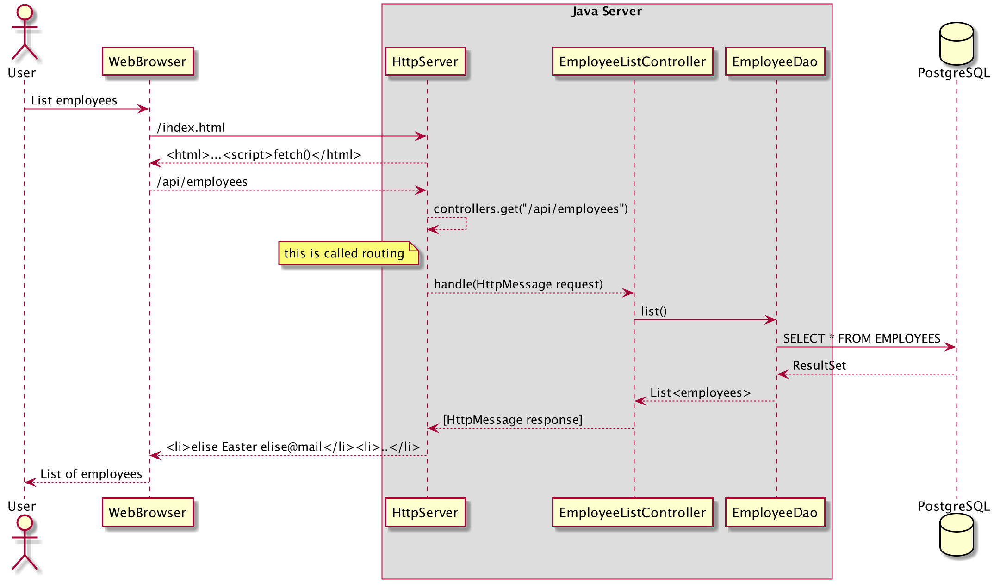
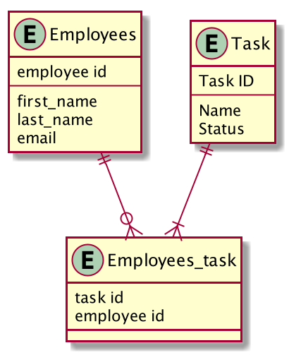

**
Link til youtube-video, parprogrammering: _https://www.youtube.com/watch?v=CSe_4dMDF1g&feature=youtu.be_**

# **Beskrivelse og funksjonalitete av prosjekt**

I dette prosjektet lager vi en server og en klient som kobles til en database av typen postgresql. Classen HttpServer starter serveren på på port 8080. Klient-klassen snakker med serveren. Brukeren opprette "employees," "tasks," redigere taskene, tildele tasker til alle employees og legge til og endre status på taskene som er blitt laget. Dette er en server som kan brukes i nettleseren og i likhet med kanban verktøy som "Trello" kan man delegere og gi oppgaver til ansatte. Vi ønsker å vise at vi mestrer grunnleggende Javaprogrammering og forståelse av hvordan en backend server og databaser kan brukes sammen for å lage et grunnleggende program. Vi har satt opp Maven som bygger en executable jar fil, gitHub Actions, lagre data i databaser i PostgreSQL, Flyway, Sockets og JDBC bibliotek. Vi (Amina Brenneng: AminaBre og Elise Easter: eliseeaster) har samarbeidet og brukt parprogrammering gjevnt gjennom hele semesteret for å løse denne oppgaven.

## **UML-diagram:**

## **Hvordan kjøre prosjektet:**

**- Tøm /target filen**
  
  Mvn clean
    
**- Deretter oppretter vi en .jar fil:**

  Mvn package 

**Deretter skal man lage en pgr203.properties fil for å lage et grunnlag for databasene som skal kjøre, den skal bygges opp slik:**

dataSource.url = jdbc:postgresql://localhost:5432/navnet på din database
dataSoure.username = ditt brukernavn
dataSource.password = passordet til brukeren

**Det siste vi må gjøre er å kjøre serveren, dette gjør du ved å skrive følgende inn i terminalen:**

java -jar target/innlevering2_amina_elise-1.0-SNAPSHOT.jar

## **Erfaringer med oppgaven**
I denne oppgaven har vi lært å bruke GitHub på en enda mer effektiv måte enn tidligere, spesielt ved hjelp av parprogrammering som det har vært mye fokus på. Ingen av oss har noen erfaring med Java annet enn i faget "introduksjon til programmering" som også foregikk digitalt under Covid-19 utbruddet, så det har vært en svært bratt læringskurve. Med tanke på tidene vi er i har det vært begrenset med veiledning ansikt til ansikt og det har vært vanskelig å fordøye all informasjonen vi skal lære på en gang. Selv om vi forstår mye av koden etter å ha fulgt forelesningene nøye, var det utfordrende å skulle sette seg ned og kode på egenhånd. Det skal også sies at både foreleser og veiledere har vært svært behjelpelige over Discord og i ekstraforelesninger, til tross for at veiledningstimene ikke har vært fysisk på skolen som før. 

Vi sitter igjen med en mye større forståelse av Java da vi har blitt mer vandt til å lese kode og prøvd å løse eksamenskravene på best mulig måte på egenhånd. Vi har lært hvor viktig det er å være nøyaktig med tanke på skrivefeil og indentering og hvordan vi kan utnytte GitHub og branches for å opprettholde orden i kaos som kan oppstå når man jobber som et team. Ikke minst har vi lært hvordan vi kan bruke "Databaser" og "Introduksjon til programmering" som vi har hatt tidligere for å lage et grunnleggende program. Til tross for at vi mest sansynelig ikke kommer til å lage en Http server i fremtiden, har det vært veldig lærerikt å se hvordan det bygges opp og fungerer i praksis.
